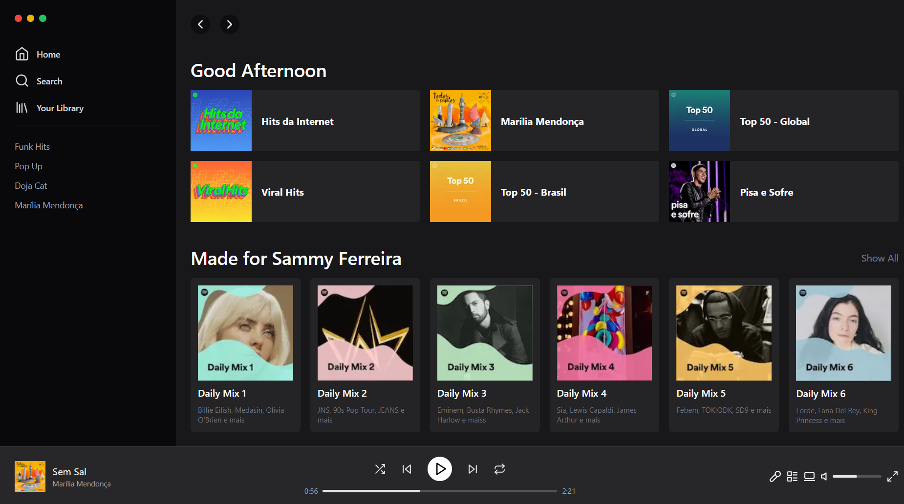

<h1 align="center"> Spotify Tailwind </h1>

  <a href="#-about">About</a>&nbsp;&nbsp;&nbsp;|&nbsp;&nbsp;&nbsp;
  <a href="#-preview">Preview</a>&nbsp;&nbsp;&nbsp;|&nbsp;&nbsp;&nbsp;
  <a href="#-tecnologies">Tecnologies</a>&nbsp;&nbsp;&nbsp;|&nbsp;&nbsp;&nbsp;

  

 

## 🧾 About

Project made together with Diego Fernandes, aiming at practicing NextJS and Tailwind.

## 🔎 Preview

  

## 🚀 Tecnologies

This project was developed with the following technologies:

- NextJs
- Tailwind
- TypeScript

---
